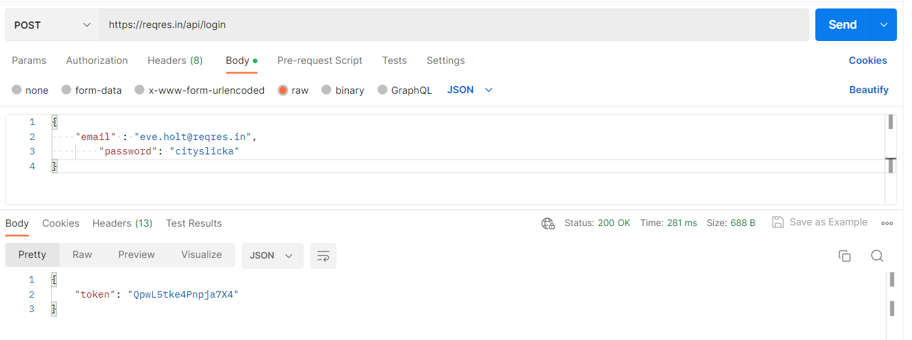

# API-Assignment

1. Make API calls using the following URIs and record the status code and response body for each API call (You will write the answer after every question and any screen capture in this document)
Get authentication token using URI: https://postman-echo.com/basic-auth
Question:

a. How did you get the response?

= I used verb : GET and worked with the given URL.
then clicked "Authorization" and select basic Auth from "Type".
I entered valid username and password and then hit the send button.
API sent me the following response and status code:

1  Unauthorised and status code : 401 Unauthorised

2. Get information about all users using 
URI: https://reqres.in/api/users

a. How many lists can you see in the response body?

= One

3. Get information about the user with id 3 using 
URI: https://reqres.in/api/users/3

a. How many lists can you see in the response body?

= No list

b. What are the available property(Key) names in the response body?

= Data", 
  
  "Id",
  
  "Email", 
   
  "First_name", 
  
  "last_name”, 
   
  "avatar",
   
  "Support”,
  
   "url",

   "text"

4.Delete the User with id 9 using URI https://reqres.in/api/users/9

a. What is the response?

= status code 204 No content.  
In response body no content is showing except 1

b. How many users are now on the users list?
https://reqres.in/api/users

= same as before

c.Can you see the deleted user record?
= yes I can Get information of the user with id 40 using URI: https://reqres.in/api/users/40

5. Get information of the user with id 40 using 
URI: https://reqres.in/api/users/40

a. How many lists can you see in the response body?

= There is no list

b. What are the available property(Key) names in the response body?

= There is no key

6. Create a new user in a system using 
URI: https://reqres.in/api/users Verb: POST Request Body:

        { 
          "name": "yourname",  
          "job": "dreamjob"
        }
img.png

a.  What is the response code?

=    
       
       {

         "name": "yourname",

         "job": "dreamjob",

         "id": "45",

         "createdAt": "2023-04-30T12:03:02.407Z"

      }

b. What are the available property(Key) names in the response body?

=   
       
     "name",

     "job", 

     "id",

    "createdAt"

c. What is the value of response Header Etag?

= W/"55-2gp0mPkDCYLCgDZnNDukhfEWG7Y

7. Sign in to the system using URI: https://reqres.in/api/login
   and {"email": "peter@klaven"}

a. What is the response code?

    status: 400 Bad Request

8. Sign in to the system using URI: https://reqres.in/api/login and
   { "email": "eve.holt@reqres.in", "password": "cityslicka" }

a. What is the value of response Header Etag?

W/"1d-lGCrvD6B7Qzk11+2C98+nGhhuec

b. What is the response?

    {

    "token": "QpwL5tke4Pnpja7X4"

     }

9. Get information about all planets using 
URI: https://swapi.dev/api/planets. 
Carefully observe the response body and make a list of all attributes and write their data types.

=

        "Count" - integer 

        "Next" - string 

        "Previous" - null 

        "Results" - array 

         "name"- string

        "Rotation_period" - string 

        "Orbital_period" - string 

       "diameter" - string 

       "climate" - string 

       "gravity" - string 

       "terrain" - string 

       "surface_water" - string

       "population" - string 

       "residents" - array /list 

       "films" - array/list

       "created" - string 

       "edited" - string 

       "url" - string
      

a. How many lists can you see in the response body?

=  3 lists total, two of them are repetitive.
There is a list under the “Result” key. The “Result” key has a list and the list contains
repetitive objects. Among those repetitive objects, “Resident” and “Film” have list type data.

10. Get information about the third planet using 
URI: https://swapi.dev/api/planets/3/

    

a. How many properties you can see in response body?

=  14

11. Get information about all the starships using 
URI: https://swapi.dev/api/starships. 
Carefully observe the response body and make a list of all attributes and write their data types.
 

=
   
       "count": integer 

       "Next": string 

       "previous": null,

       "results":array 

       "name": string 

       "model": string 

       "manufacturer": string 

       "Cost_in_credits": string 

        "length": string 

       "max_atmosphering_speed":string 

       "crew": string 

       "passengers": string 

       "cargo_capacity": string

       "consumables": string

       "Hyperdrive_rating": string 

       "MGLT": string

       "Starship_class" string 

       "pilots": array 

       "films": array 

       "Created" string 

       "edited": string 

       "url": string

a. How many lists can you see in the response body?

=3 list; result, pilot,film these three key has array type value

12. Get information about the ninth starship using 
URI: https://swapi.dev/api/starships/9/

a.How many lists can you see in the response body?

=  2 lists. pilot and film

13. Get information about all films using 
URI: https://swapi.dev/api/films. 

Carefully observe the response body and make a list of all attributes 
and write their data types.
  
= 

     "count": integer      "next": null,              "previous": null,          
 

     "title": string      "episode_id": integer,      "opening_crawl": string,

     "director": string   "producer": string         "release_date": string 

     "Characters": array   "starships": array         "vehicles": array 

     "species": array      "created": string         "edited": "2string 

      "url":string        "results":array,

a.How many lists can you see in the response body?

=  6

14. Get information about the third planet using URI:
https://swapi.dev/api/species

a. How many lists can you see in the response body?

= 2 list under planet 3

15. Get all booking ids using URI: 
https://restful-booker.herokuapp.com/booking

a. How many lists can you see in the response body?

= 1

16. Get details about booking id 23 using URI:
https://restful-booker.herokuapp.com/booking/23

a. What is the response?

=   
     
    {

    "firstname": "Jane",

    "lastname": "Doe",
    
    "totalprice": 111,

    "depositpaid": true,
    
    "bookingdates": 

        {

          "checkin": "2018-01-01",

          "checkout": "2019-01-01"

        },

    "additionalneeds": "Extra pillows please"

    }

17. Get details about booking id 3 using URI: 
https://restful-booker.herokuapp.com/booking/3
 

a. What is the response?

    {

    "firstname": "Mary",

    "lastname": "Jones",

    "totalprice": 238,

    "depositpaid": false,

    "bookingdates":

                  {

                  "checkin": "2015-07-26",

                   "checkout": "2016-01-27"

                  },

    "additionalneeds": "Breakfast"

    }

18. Get information about all planets using URI: 
https://swapi.dev/api/planets

a. What is the response?

= status 200 ok 

b. How many lists can you see in the response body?

= There are total 3 lists.  2 of them are repetitive. There is a list under “Result” key. 
and it contains repetitive objects.
Among those repetitive objects, “Resident” and “Film” have list type data.

19. Get informati on about all species using URI: 
https://swapi.dev/api/species
Carefully observe the response body and make a list of all attributes and write their data types.

a. How many lists can you see in the response body?

= 3 lists.
result, people, film

b.What is the response?

= status 200 ok

 

20. Write JSON path for following JSON file:

{

"studio": {

       "movie": [

{
"category": "history",

"director": "John",

"title": "History",

"rating": 6.60

},

{

"category": "comedy",

"director": "Paul",

"title": "Laugh",

"rating": 4.00

},

{

"category": "fiction",

"director": "Jack",

"title": "Wake",

"isbn": "87877676879",

"rating": 8.01

},

{

"category": "drama",

"director": "Edward",

"title": "Wuthering Heights",

"isbn": "8754543578",

"rating": 4.50

}

          ],

   "music":    {

"song": "pale",

"rate": 5.4

           }

},

"ranking": 20

}

a. To retrieve all direct properties of the studio object

=  

    x.studio

b. To find out the music’s song

=   
     
    x.studio.music.song

c. To find the rating of all items in the studio

=

    x.studio.movie[0].rating

    x.studio.movie[1].rating

    x.studio.movie[2].rating

    x.studio.movie[3].rating

d. To retrieve information on all movies

=   
     
     x.studio.movie

    
e. To find out the titles of all movies

=

    x.studio.movie[0].title

    x.studio.movie[1].title

    x.studio.movie[2].title

    x.studio.movie[3].title

f. To retrieve the titles of all movies by Jack

=  
   
     x.studio.movie[2].director

g. To retrieve the category of the last movie

=

    x.studio.movie[3].category

i. To retrieve all movies that have the isbn property

=

     x.studio.movie[2].isbn

     x.studio.movie[3].isbn

21. Get information about all employess using 
URI: http://dummy.restapiexample.com/api/v1/employees

a. How many lists can you see in the response body?

= only 1

b. What is the response?

= 200 OK

c. What are the available property(Key) names in the response body?

=  
     
     "status"      "data",      "id",        "employee_name",

     "employee_salary”,       "employee_age",         "profile_image",         "message"

d. Make a list of all attributes and write the data types.

=
    
      "Status" string,       "Data" array,     

       "Id" integer,       "employee_name" string, 

      "Employee_salary” integer,     "Employee_age" integer,

      "profile_image" string ,      "message" string
 

22. Get a single employee data using 
URI: http://dummy.restapiexample.com/api/v1/employee/3

a. How many data you can see in response body?

= ????????????????????????

b. What is the response status? 

=  status 200 ok

23. Create a new employee in a system by using 
URI: http://dummy.restapiexample.com/api/v1/create 

Verb: POST Request Body:

{

"name":"Aysha",

"salary":"123",

"age":"23"

}

PICTURE -A

a. What is the response?

= status: 404 Not Found  (for first couple of tries)

{
"message": "Error Occured! Page Not found, contact rstapi2example@gmail.com"
}

this one was from my previous try after 1st class and it worked then

PICTURE - B

b. can you see "id" property in the response? if Yes, note the "id" value.

=   the question given here, showing error 404, (picture a above)
but from previous successful try
"id": 4914 (see picture b above)

24. Delete an employee record whose employee id in 2 by using URI 
http://dummy.restapiexample.com/api/v1/delete/2
 

 

a. What is the response?

= 200 OK

b. How many employees are now in the employees list? http://dummy.restapiexample.com/api/v1/employees

c. Can you see the deleted employee record?

=  Yes

25. Register a user by using
URI: https://reqres.in/api/register 

Verb: POST Request Body:

{

"email": "john.jack@example.com",

"password": "@izaanSchool"

}

a. What is the response?

= 
   status : 404 Bad Request

b. What are the available property(Key) names in the response body?

=  "error"

26.Get an user Using URL https://reqres.in/api/unknown/2

a. What is the response?

=  status 200 ok

27. A simple health check endpoint to confirm whether the API is up and running using 
https://restful-booker.herokuapp.com/ping

a. What is the response?

= 201 Created

28. Get information using Delayed Response using 
URI: https://reqres.in/api/users?delay=3

a. What is the response?

=  200 OK

b. How many seconds delay to respond?

=  3.31 s

29. Get information about vehicles using 
URL https://swapi.dev/api/vehicles/schema/

a.What type of response it is?

=   JSON type

b. What is response status code?

=   404 NOT FOUND

30. Get information about starships using 
URL https://swapi.dev/api/starships/schema/

a. What type of response it is?

=  Json Type

b. Write down the response status code.

=  404 NOT FOUND

c.What are the available property(Key) names in the response body?

=  "detail"

